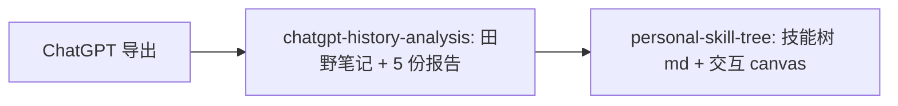

# chatgpt-history-analysis

两个可组合的 [Cursor](https://cursor.com) Agent Skill：把你自己的 ChatGPT 数据导出，变成一份有证据、有深度的纵向自我分析，再进一步提炼成一棵可复用的个人技能树。

全程**本地处理**，原始数据不上传任何地方。

## 组合流水线



两个 skill 可以分开用，也可以串起来：先用 `chatgpt-history-analysis` 把聊天记录跑成报告，再用 `personal-skill-tree` 把报告里的能力提炼成技能树。

---

## Skill 1：`chatgpt-history-analysis`

把一个 ChatGPT 数据导出文件夹（`conversations-*.json`）变成 5 份中文分析报告。

它会：

1. 抽取你写过的所有消息，按时间排序、切片成语料；
2. 用多个并行子代理，为每个时间段写一份"田野笔记"（带日期原句证据）；
3. 综合所有笔记，生成 5 份报告：
   - `分析报告.md` — 八问深度分析（成长轨迹、重复模式、能量来源、天赋、限制因素、人生主题、十年预测、三件事）
   - `最重要的一件事.md` — 只讲一件你最该明白的事 + 五年分叉
   - `近半年能力增长与自我认知.md` — 增长最快的能力、自评偏差、过期旧故事、复利链
   - `核心增长引擎.md` — 若只能保留一种成长能力该选哪个（含能力因果图）
   - `未来六个月成长路线图.md` — 逐月路线、优先级矩阵、风险、时间预算、预测

**为什么是 map-reduce**：一份半年以上的 ChatGPT 记录，用户消息常常有 ~100 万 token，单次读不完。

```
extract.py → corpus/part-XX.txt（约 11 片）→ N 个并行子代理 → notes/notes-part-XX.md → 主代理综合成 5 份报告
```

"map"（并行读每一片写笔记）解决上下文放不下的问题，"reduce"（主代理只读笔记不读原始语料）解决综合判断的问题。

**安装**

```bash
cp -R chatgpt-history-analysis ~/.cursor/skills/chatgpt-history-analysis
```

**用法**

1. 在 [ChatGPT 设置里导出你的数据](https://help.openai.com/en/articles/7260999-how-do-i-export-my-chatgpt-history-and-data)，解压得到含 `conversations-*.json` 的文件夹。
2. 在 Cursor 里让 agent 用这个 skill 分析该文件夹。
3. 报告会输出到一个以"跑分析的模型"命名的目录（如 `gpt-5.5/`），方便你换不同模型跑，横向对照它们的"第二意见"。

单独跑抽取脚本也可以：

```bash
python3 chatgpt-history-analysis/scripts/extract.py <你的导出文件夹> <输出目录>/corpus
```

---

## Skill 2：`personal-skill-tree`

把上面的能力分析（或任何带日期原句的自我记录）提炼成一棵**可复用的个人技能树**。

它会：

1. 从能力报告 / 田野笔记里收集每项能力 + 带日期的原句证据；
2. 让数据决定一级领域（通常 5-8 个 + 一个 `Growing Edges` 训练区，把瓶颈当一等公民列出来）；
3. 每个二级技能填四个字段：定义 / 证据（带日期原句）/ 什么时候复用 / 熟练度；
4. 熟练度分四档：◆ Core（核心引擎）· ● Strong（高速成长）· ○ Solid（稳定）· ▲ Training（训练中）；
5. 输出两种形式：
   - `personal-skill-tree.md` — ASCII 总览树 + 图例 + 逐技能展开 + 因果图；
   - `skill-tree.canvas.tsx` — 可点开每个技能看"证据 / 复用"的交互式 Cursor Canvas。

**安装**

```bash
cp -R personal-skill-tree ~/.cursor/skills/personal-skill-tree
```

**用法**

在 Cursor 里让 agent 用这个 skill，基于你的能力报告 / 田野笔记（或先跑 `chatgpt-history-analysis`）生成技能树。产出同样落到以模型命名的目录里，方便横向对照。

---

## 目录结构

```
chatgpt-history-analysis/            # 本仓库
├── README.md
├── chatgpt-history-analysis/        # Skill 1
│   ├── SKILL.md                     # 主定义 + map-reduce 流水线
│   ├── scripts/extract.py           # 抽取 + 切片脚本（无第三方依赖）
│   └── references/
│       ├── prompts.md               # 5 份报告的原始 prompt（逐字保留）
│       └── field-note-template.md   # 子代理写田野笔记的模板
└── personal-skill-tree/             # Skill 2
    ├── SKILL.md                     # 主定义 + 6 步方法 + 熟练度判定
    └── references/
        ├── skill-tree-template.md   # Markdown 成品模板
        └── canvas-template.tsx      # 交互 canvas 模板
```

## 隐私

- 原始导出与所有分析产物都留在本地，脚本不联网、不上传。
- 分析产物（报告、田野笔记、技能树里填了真实内容的版本）包含高度私密的个人内容，**不要**把它们提交到公开仓库。本仓库只公开两个 skill 本身，模板里全是占位符，不含任何个人数据。

## License

MIT
