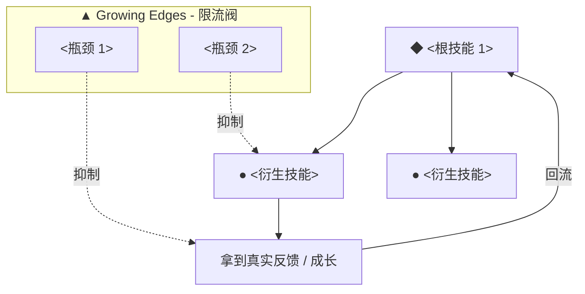

# Markdown skill-tree template

Fill the placeholders. Keep the section order. Marks: `◆` Core, `●` Strong, `○` Solid, `▲` Training. Replace `<Name>` with the person's handle.

---

# <Name> OS v1.0 — 个人技能树

> 数据来源:<列出实际用到的报告 / 田野笔记 / 语料文件>。
> 所有证据均为本人写下的**原句 + 日期**。这是一棵可复用的技能树:遇到问题时,先来这里"提取 skill",而不是从零硬扛。

---

## 总览

```
<Name> OS v1.0
│
├── <Domain 1 EN>  <中文>(根引擎)
│   ├── ◆ <Skill>            <中文>
│   ├── ◆ <Skill>            <中文>
│   ├── ● <Skill>            <中文>
│   └── ● <Skill>            <中文>
│
├── <Domain 2 EN>  <中文>
│   ├── ● <Skill>            <中文>
│   ├── ○ <Skill>            <中文>
│   └── ▲ <Skill>            <中文>(训练中)
│
├── ...more domains (让数据决定,通常 5-8 个)...
│
└── Growing Edges  训练中(约束节点·非强项)
    ├── ▲ <Skill>            <中文>(瓶颈)
    └── ▲ <Skill>            <中文>
```

**熟练度图例**

| 标记 | 等级 | 含义 |
|---|---|---|
| ◆ | **Core** 核心引擎 | 既是根、又在高速成长、且给其他所有能力供能。删掉它主回路会断。 |
| ● | **Strong** 高速成长 | 近期陡增的新曲线,已可稳定调用。 |
| ○ | **Solid** 稳定 | 长期稳定在高位的老曲线,增速平缓。 |
| ▲ | **Training** 训练中 | 瓶颈 / 约束节点,是要重点练的肌肉,不要用"我在成长"盖过去。 |

> **一句话读法**:`◆` 那几项是发动机;大部分 `●` / `○` 是它的产物;最下面一排 `▲` 是限流阀——修好它们,上面所有天赋才放得出来。

---

## <Domain 1 EN> <中文>(根引擎)

### ◆ <Skill EN> <中文>
- **定义**:<一句话说清这是什么能力>。
- **证据**:[YYYY-MM-DD]「<原句>」;<其他带日期的事件>。
- **什么时候复用**:<下次在什么具体情境主动调用它>。

### ● <Skill EN> <中文>
- **定义**:...
- **证据**:[YYYY-MM-DD]「...」。
- **什么时候复用**:...

<!-- 每个技能都用上面这四行结构:定义 / 证据 / 什么时候复用。带健康或安全红线的技能,在"什么时候复用"里用「⚠️ 红线:...」标注。 -->

---

## <Domain N EN> <中文>

<!-- ...重复每个领域... -->

---

## Growing Edges 训练中(约束节点 · 非强项)

> 这几项是**限流阀**:分别掐住"尝试—反馈—复原"主回路的不同环节。它们不是能力缺失,而是要被当成一等公民来修的瓶颈。

### ▲ <Skill EN> <中文>(瓶颈)
- **证据**:[YYYY-MM-DD]「...」。
- **什么时候复用**:<把它当成什么来对待 / 用哪个已有 skill 来补它>。

---

## 因果读法(哪些是根、哪些被驱动)



- **根(◆)**:<列出根节点及为何是根>。
- **衍生(● / ○)**:<列出被驱动的能力>。
- **限流阀(▲)**:<列出瓶颈>——修好它们,上面所有天赋才放得出来。
- **复用原则**:遇到卡点先问"这是缺哪个 skill,还是被哪个 ▲ 限流了"。多数时候不是能力不够,是限流阀关着。

---

*本文件基于第一视角语料,证据均为原句 + 日期。交互版见 `skill-tree.canvas.tsx`。*
